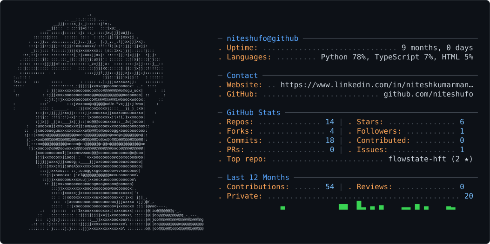

<picture>
  <source media="(prefers-color-scheme: dark)" srcset="dark_mode.svg" />
  <source media="(prefers-color-scheme: light)" srcset="light_mode.svg" />
  
</picture>

# 💫 About Me

🔭 Currently building AI/ML systems, LLM applications & quantitative trading projects  
🤝 Open to collaborating on AI, ML, LLMs, open-source & research projects  
🌱 Currently learning Agentic AI, LLMs, MLOps & quantitative systems  
💬 Ask me about Python, AI/ML, Computer Vision, LLMs & HFT  
🛠️ I like turning ideas into things that actually work  
⚡ Fun fact: I usually start with a “small project” and somehow turn it into a full system  

## 🌐 Connect With Me

## 🚀 Currently Building

- ⚡ **FlowState HFT** — research-driven quantitative trading system
- 🧠 **LLM & Agentic AI** experiments
- 🚦 **Intelligent Traffic Prediction** & lane-aware signal control
- 🔬 Research around **LLM optimization & efficient AI systems**

# 💻 Tech Stack

### Languages

### AI / ML

### Data

# 📊 GitHub Stats

---

